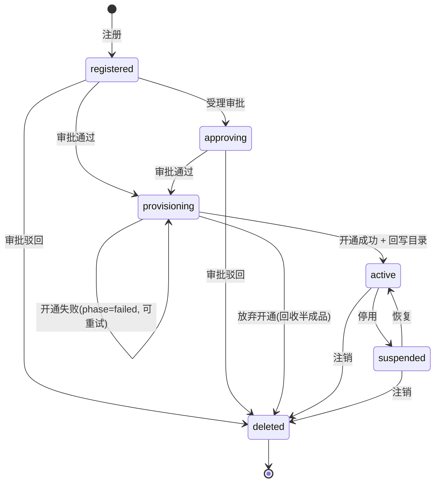

# ICD · 控制平面租户开通（状态机 + 外呼边界）

> 跨切面**编排契约**：固化租户目录**状态机**与控制平面**外呼开通边界**（Keycloak / Helm / 数据存储 / ESO）。
> **仅契约，不含实现**——实现在 `services/control-plane`。北向 REST 字段级 schema 以
> [`openapi/control-plane-v1.yaml`](../openapi/control-plane-v1.yaml) 为权威；本 ICD 不重复字段定义。
> 关联：架构 05《多租户与控制平面》§2/§4；主仓 spec §2。占位均脱敏（`acme` / `tenant-demo`）。

## 1. 目的与范围

控制平面是**跨租户单例**，按「自助注册 → 审批门控 → 命令式 provision → 回写租户目录」开通租户。本 ICD 固化两件**消费方（webui 渲染、deploy per-tenant chart 对齐、各子系统理解开通语义）须共守**的约定：

1. **状态机**：租户目录条目的合法状态与迁移（§2）——webui 据此渲染、控制平面据此校验迁移。
2. **外呼边界**：控制平面向 Keycloak / Helm / 数据存储 / ESO 的**编排边界**（§3）——只约定边界（触发、输入、回写、幂等、失败语义），**不约定各下游内部实现**。

> 范围外：各下游（Keycloak Admin API、Helm chart、PG/Doris DDL、ESO CRD）的内部细节；网关→上游的租户头透传（见 [`icd/tenant-context-headers`](./tenant-context-headers-icd.md)）。

## 2. 租户目录状态机

状态枚举以 `openapi/control-plane-v1.yaml` 的 `TenantStatus` 为权威：`registered → approving → provisioning → active → suspended → deleted`。

| 当前态 | 动作 / 事件 | 触发者 | 次态 | 北向 API |
|--|--|--|--|--|
| —（无） | 自助注册 | 租户 / 运营 | `registered` | `POST /v1/tenants` |
| `registered` | 受理审批（审批工作流开启） | 运营管理员 | `approving` | 服务内迁移（裁决端点亦接受 `registered`） |
| `registered` / `approving` | 审批通过 | 运营管理员 | `provisioning` | `POST /v1/tenants/{id}/approval` `{approve}` |
| `registered` / `approving` | 审批驳回 | 运营管理员 | `deleted` | `POST /v1/tenants/{id}/approval` `{reject}` |
| `provisioning` | 全部开通步骤成功 + 回写目录 | control-plane（异步） | `active` | 经 `GET /v1/tenants/{id}/provisioning` 观测 |
| `provisioning` | 任一关键步骤失败 | control-plane | `provisioning`（`ProvisioningStatus.phase=failed`） | 可重试，**不进** `active` |
| `provisioning` | 放弃开通 / 回收半成品（deprovision） | 运营管理员 | `deleted` | `DELETE /v1/tenants/{id}` |
| `active` | 停用 | 运营管理员 | `suspended` | `POST /v1/tenants/{id}/suspend` |
| `suspended` | 恢复 | 运营管理员 | `active` | `POST /v1/tenants/{id}/resume` |
| `active` / `suspended` | 注销（异步 deprovision） | 运营管理员 | `deleted` | `DELETE /v1/tenants/{id}` |

- **终态**：`deleted`（注销后保留目录条目作审计；此时 `DataPlaneRef` / `OrganizationRef` 对应资源已回收，目录条目仅作历史快照，接入 ref **不可再路由**）。
- **失败不新增顶层状态**：开通失败租户停在 `provisioning`，失败细节经 `ProvisioningStatus.phase=failed` + 分步 `ProvisioningStep.status=failed` 表达（与 issue 既定 6 态机一致，便于重试）。**反复失败**可由运营管理员经 `DELETE` 放弃开通（`provisioning → deleted`，回收半成品），保证无死锁。
- **允许注销的态**：`provisioning`（放弃）/ `active` / `suspended`；其它态经 `DELETE` 返回 `409`。
- **审批驳回**：`reason` 必填（驳回置租户为 `deleted` 不可逆，须留审计理由；OpenAPI `ApprovalDecision` 已用 `if/then` 在 schema 层强制）。

## 3. 外呼开通边界（仅契约，不含实现）

审批通过后，控制平面经 **Helm SDK + Kubernetes Java client 命令式**编排（不依赖 Git/Argo），分步外呼下列目标。各步对应 `ProvisioningStep.target`，按下表顺序执行；任一关键步失败 → 整体 `phase=failed`、停在 `provisioning`、可重试。

| `target` | 外呼对象 | 触发时机 | 输入（来自 Tenant） | 输出 / 回写目录 | 幂等键 | 失败 / 重试语义 |
|--|--|--|--|--|--|--|
| `keycloak` | Keycloak Admin API（**Organizations**，单 realm，org=租户） | 审批通过第一步 | `tenantId` · `displayName` · `adminEmail` | `OrganizationRef`（`orgId` / `orgAlias`）；可选联邦客户 AD | `orgAlias`(=tenantId) | 已存在则复用（幂等）；失败 → `phase=failed` |
| `helm` | Helm SDK + K8s client（**per-tenant release**） | 建 org 后 | `tenantId` · `QuotaSpec` | `DataPlaneRef`（`namespace` / `helmRelease`）；ns + ResourceQuota/LimitRange + NetworkPolicy + 服务实例 | release 名 `tenant-<id>` | `helm upgrade --install` 幂等；失败 → `phase=failed` |
| `datastore` | PG schema/db + Doris/Paimon catalog/database | release 就绪后 | `tenantId` | `DataPlaneRef`（`dbSchema` / `dorisCatalog`） | schema/catalog 名 | DDL 幂等（IF NOT EXISTS）；失败 → `phase=failed` |
| `secrets` | **External Secrets Operator** | 数据存储就绪后 | `tenantId` | 注入运行期 secrets（**不回写明文**） | `ExternalSecret` 名 | 幂等 reconcile；🔴 secrets 不入库（红线） |

- 全部成功 → 回写租户目录（`status=active` + `OrganizationRef` + `DataPlaneRef`），开通完成。
- **注销 deprovision** = 逆序回收（`secrets → datastore → helm → keycloak`；`keycloak` org 可按策略保留审计），同样以 `ProvisioningStatus.phase` 表征进度。
- 这些外呼对象**非 hashmatrix 子仓**（基础设施 / Operator）：本表只立**控制平面侧的边界**，对端实现与版本由部署（`deploy/` per-tenant chart、ESO、基座）治理。

## 4. 信任与安全模型

- 北向 API 经**网关 APISIX** 校验 JWT 后调用；控制平面信任网关注入的身份与 `X-Tenant-*`（见 [`icd/tenant-context-headers`](./tenant-context-headers-icd.md)）。运营管理员可操作全部端点，租户自助注册为受限子集。
- **外呼凭据**（Keycloak Admin、kubeconfig、ESO 后端）一律经 ESO / 运行期注入，**绝不入库**（红线）；本 ICD 与 OpenAPI 示例均不含真实主机 / 凭据。
- 控制平面是**一等 K8s 编排者**，生产期租户开通**不耦合 Git/Argo**；Argo CD 仅作共享基座可选 GitOps。

## 5. 版本与兼容策略

- 本 ICD 走 semver，与 `openapi/control-plane-v1` 协同。**加法兼容**（新增状态/步骤目标/可选字段）走 MINOR 且消费方 tolerant reader；**改名 / 改语义 / 删状态 / 改迁移规则**为破坏性，需 MAJOR + 弃用期双跑 + 通知 consumers。
- `TenantStatus` / `ProvisioningStep.target` 枚举值**收紧或改名属破坏**；新增枚举值为加法兼容，消费方须容忍未知枚举（fallback 而非报错）。

## 6. 一致性校验要点（契约测试）

- **状态机一致性**：control-plane 实现的状态迁移必须等于 §2 表（非法迁移 → `409`，对应 OpenAPI `StateConflict`）；建议状态机单测覆盖每条迁移与每个非法迁移。
- **枚举一致性**：`TenantStatus` / `ProvisioningPhase` / `ProvisioningStep.target` 的取值必须与 `openapi/control-plane-v1.yaml` 完全一致（单一事实源在 OpenAPI）。
- **幂等性**：每个外呼步骤在重试下幂等（§3 幂等键），provisioning 可安全重入。
- 纳入平台契约测试框架并与 webui（渲染）/ deploy（per-tenant chart）对齐后，本 ICD 升 `review` → `stable`。
