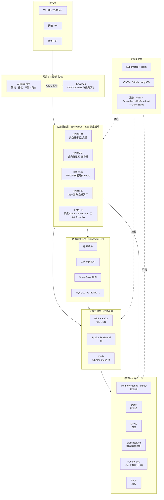
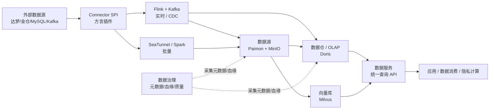

# 01 · 架构总览

## 1. 分层架构图

**线框图**（纯文本速览，终端/代码评审/Word/PDF 均可读）：

```text
┌────────────────────────────────────────────────────────────────────────┐
│  接入层   WebUI(TS) · 开放API · 运维门户                                   │
├────────────────────────────────────────────────────────────────────────┤
│  网关(南北向)  APISIX/SCG · 统一认证 Keycloak/OAuth2 · 限流·审计           │
├────────────────────────────────────────────────────────────────────────┤
│  应用服务层 (Spring Boot · K8s原生发现:Service/DNS · 配置:ConfigMap)       │
│   ┌────────┬────────┬─────────┬──────────┐                              │
│   │数据治理 │数据安全 │隐私计算  │数据服务   │  ← 普通无状态应用             │
│   │元数据/ │分类分级/│MPC/PSI/ │统一查询/  │    K8s Deployment           │
│   │模型/质量│标签/审批│匿踪(Py) │数据资产   │    HPA 自动扩缩              │
│   └────────┴────────┴─────────┴──────────┘                              │
│   应用内: Resilience4j(限流熔断)  [可选] Nacos/Apollo 仅做动态业务配置      │
│   平台公共能力: 调度 DolphinScheduler · 工作流 Flowable                    │
├────────────────────────────────────────────────────────────────────────┤
│  ★数据源接入层 Connector SPI   标准JDBC/CDC + 方言插件                     │
│     [达梦插件] [人大金仓插件] [OceanBase插件] [MySQL/PG/Kafka...]          │
│     (SeaTunnel/Flink-CDC 插件框架；各插件可独立并行开发)                    │
├────────────────────────────────────────────────────────────────────────┤
│  计算处理层(数据基础)  流:Flink+Kafka  批:Spark/SeaTunnel  OLAP:Doris      │
├────────────────────────────────────────────────────────────────────────┤
│  存储层(湖仓一体)  湖:Paimon/Iceberg+MinIO  仓:Doris  向量:Milvus         │
│                    搜索:ES  平台业务库:PostgreSQL(开源)  缓存:Redis        │
├────────────────────────────────────────────────────────────────────────┤
│  云原生底座  Kubernetes + Helm(umbrella) · CI/CD(GitLab+ArgoCD)           │
│    观测 OTel+Prometheus/Grafana/Loki/SkyWalking · [后置]Service Mesh      │
│    双轨适配: 标准开源 ←→ 信创(鲲鹏/麒麟/达梦) 由部署层 values 切换           │
└────────────────────────────────────────────────────────────────────────┘
```

**Mermaid 版**（支持渲染的环境显示精细版）：



> 关键点：中间不再有「Spring Cloud + Nacos 重治理」层 —— 应用就是普通 Spring Boot 服务，由 K8s 负责发现/扩缩/自愈；治理责任下沉到平台（见 [02-平台治理与网关](./02-平台治理与网关.md)）。

## 2. 五大分系统与应用服务映射

| 分系统 | 对应应用服务 | 主要能力 | 关键依赖 |
|---|---|---|---|
| 数据基础 | data-foundation | 流批采集、湖仓存储、统一计算、向量/非结构化 | Flink/Kafka/Spark/SeaTunnel · Paimon/MinIO/Doris/Milvus/ES |
| 数据治理 | governance | 元数据/**元模型引擎**、专题-主题-实体三层模型、数据标准、数据质量、血缘 | **自研元模型引擎**(Atlas 蓝本) · PostgreSQL · ES |
| 数据工具(隐私计算) | privacy | MPC、安全求交(PSI)、匿踪查询、可视编排、节点互联 | 隐语 SecretFlow（Python） |
| 数据安全 | security | 分类分级（五层目录）、标签规则、工作流审批、安全审计、资源监控 | Flowable · Prometheus |
| 数据服务(横切) | data-service | 统一查询、数据资产目录、API 资产化 | Doris/PostgreSQL |
| 平台公共(横切) | platform-common | 调度、工作流引擎、统一元数据 | DolphinScheduler/Flowable |

## 3. 端到端数据流

**线框图**：

```text
 外部数据源 ──▶ Connector SPI ──▶ 采集 ──▶ 湖仓一体 ──▶ 数据服务API ──▶ 应用/数据消费/隐私计算
 (达梦/金仓/                       │          │
  MySQL/Kafka)                     │          ├─ 数据湖  Paimon + MinIO
                                   │          ├─ 数据仓  Doris (OLAP·点查·实时数仓)
                                   │          └─ 向量库  Milvus
                                   ├─ 实时链路: Flink + Kafka(CDC)    入湖 ≤5s / 70万条·s
                                   └─ 批量链路: SeaTunnel / Spark     触发→入湖 ≤15min

 旁路: 数据治理(元数据/血缘/质量) 采集各环节信息，不挡主链路
```

**Mermaid 版**：



**两条主链路**

- **实时链路**（满足入湖 ≤5s / 70 万条·s）：源 → Connector(CDC) → Flink/Kafka → Paimon 湖 + Doris 仓 → 数据服务。
- **批量链路**（触发→入湖 ≤15min）：源 → Connector → SeaTunnel/Spark → Paimon 湖 → Doris。

治理（元数据/血缘/质量）作为**旁路**采集各环节信息，不挡主链路。

## 4. 数据源统一管理与两类采集（边界澄清）

「数据源接入层（Connector SPI）+ 数据源统一管理（连接注册 / 凭证托管 / 连通性探测 / 方言适配）」是**平台共享能力**，被**两类采集**复用——它们**同源不同流**：

| | 数据采集（data-foundation） | 元数据采集（governance） |
|--|--|--|
| 取什么 | **行数据**（搬数据入湖入仓） | **结构/元数据**（库表字段结构、关系、统计） |
| 怎么取 | Flink-CDC / SeaTunnel / Spark | 结构扫描 / 变更集比对 / 结构异动检测 |
| 产出 | Paimon 湖 + Doris 仓里的数据 | 元数据实例（遵循元模型）+ 血缘 + 变更事件 |
| 链路 | 主链路（实时 ≤5s / 批 ≤15min） | **旁路**，不挡主链路 |
| 调度 | 独立 | 独立 |

要点：

- **连接器只实现一次**：信创方言插件（达梦 / 金仓 / OceanBase）在 Connector SPI 实现一次，两类采集共用，杜绝重复实现与团队相互阻塞。
- **数据源定义共享、引用态消费**：数据源（连接、库表清单、凭证）由统一数据源管理维护；数据采集任务与元数据采集任务都**引用**同一数据源，不各自维护。
- **元数据采集 ≠ 数据采集**：前者是治理域的结构盘点（OpenMetadata/Atlas 式 ingestion），后者是数据基础的数据搬运（ETL/CDC）；二者产出、SLA、归属团队均不同。
- **归属**：Connector SPI 与数据源统一管理为共享层（实现可落在 data-foundation 或独立共享服务），governance 与 data-foundation 均为消费方；具体落仓在 `data-foundation` 仓专题细化。
