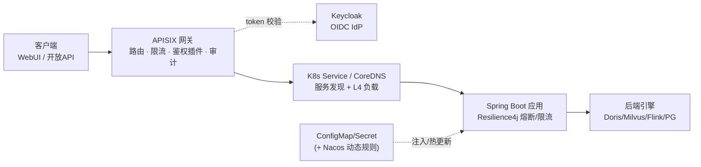
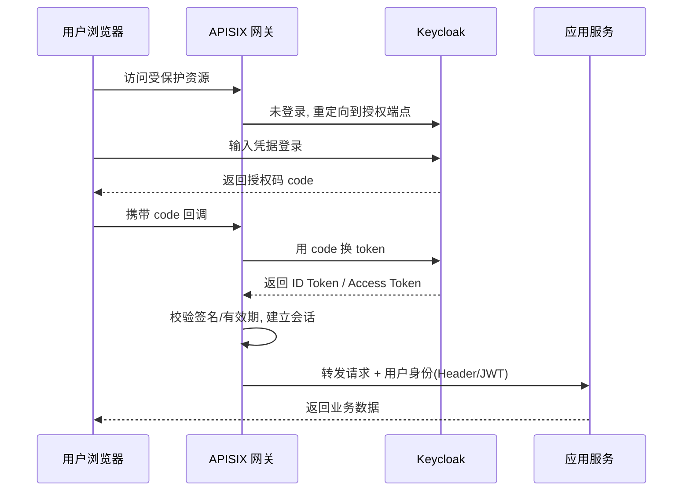
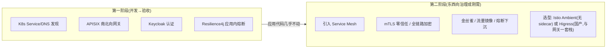

# 02 · 平台治理与网关

本篇是架构的核心结论：**治理能力下沉到平台，应用保持瘦**，不采用完整的 Spring Cloud 服务治理。

## 1. 治理责任归属

| 治理关注点 | 放在哪 | 选型 | 为什么长期稳 |
|---|---|---|---|
| 服务发现 / 负载 / 扩缩 / 自愈 / 部署 | **K8s 平台** | Deployment + Service/DNS + HPA + Probe | 事实标准、社区最大、信创支持最全、甲方最易接手 |
| 南北向网关 | **独立基础设施** | **APISIX**（首选）/ SCG | 配置驱动+热加载、与发版解耦、高性能、与 Keycloak 原生集成 |
| 统一认证授权 | 网关 + IdP | **Keycloak (OIDC)** | CNCF；JVM 可跑信创；应用零侵入 |
| 配置 | K8s + 可选配置中心 | ConfigMap/Secret + Reloader；动态业务规则才上 **Nacos（仅 Config）** | 少组件；Nacos 不与 K8s 抢服务发现 |
| 限流熔断 | **应用内** | **Resilience4j** | Hystrix 官方继任者，活跃维护 |
| 可观测 | 平台 | **OpenTelemetry** + Prometheus/Grafana/Loki + SkyWalking | 标准化、不绑框架 |
| 东西向高级流量（金丝雀/mTLS/零信任） | **后置 Service Mesh** | Istio Ambient / Higress | 真成刚需再上，不提前付复杂度 |

> **为什么不用完整 Spring Cloud 做主干**：① Spring Cloud Netflix 老栈（Hystrix/Ribbon/Zuul/Eureka）已 EOL=负债；② K8s 上叠 Nacos 注册=双注册中心反模式；③ 治理塞进 SDK=框架升级即全量回归；④ 甲方要拿源码自维护+扛 99.99% 质保，组件越少越稳。Spring Cloud Alibaba 不被全盘否定——只取其「Nacos 仅做配置」这一配角部分。

## 2. 请求路径（南北向）

**线框图**：

```text
 客户端              APISIX 网关                K8s             Spring Boot 应用       后端引擎
 ┌────────┐  HTTPS  ┌──────────────┐  service  ┌─────────┐    ┌───────────────┐    ┌────────────┐
 │WebUI / │ ──────▶ │路由·限流·审计  │ ─DNS───▶ │发现/L4   │──▶ │业务逻辑        │──▶ │Doris/Milvus│
 │开放API │         │鉴权(OIDC插件) │           └─────────┘    │Resilience4j   │    │Flink/PG    │
 └────────┘         └──────┬───────┘                          │(熔断/限流)     │    └────────────┘
                           │ token 校验                        └───────▲───────┘
                           ▼                                          │ 注入/热更新
                     ┌──────────┐                           ┌────────────────────┐
                     │ Keycloak │                           │ ConfigMap/Secret    │
                     │ (OIDC)   │                           │ (+ Nacos 动态规则)  │
                     └──────────┘                           └────────────────────┘
```

**Mermaid 版**：



要点：

- **认证在网关侧完成**（APISIX `openid-connect` 插件对接 Keycloak），应用拿到已校验的身份，业务代码零侵入。
- **服务间调用走 K8s Service DNS**（`http://governance.svc/...`），不经 Nacos 注册中心。
- **熔断/限流在应用内**用 Resilience4j（对下游引擎调用做隔离/降级）。

## 3. 认证流（OIDC 授权码模式）



## 4. Service Mesh 演进路径



> 备注：Linkerd 技术上轻量优秀，但其稳定版自 2024 起转为商业授权（一定规模企业生产使用需付费），对「长期免费自维护」的政企项目需谨慎，故演进首选 **Istio Ambient** 或 **Higress**。
