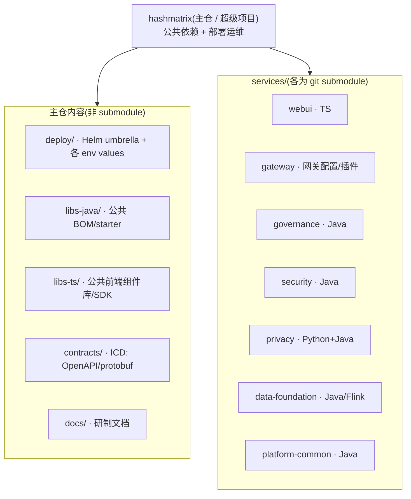
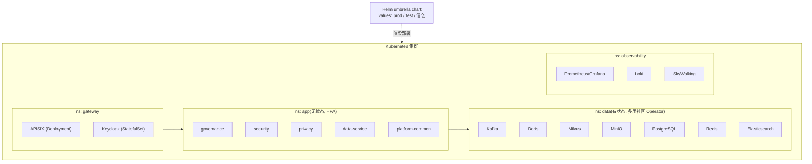
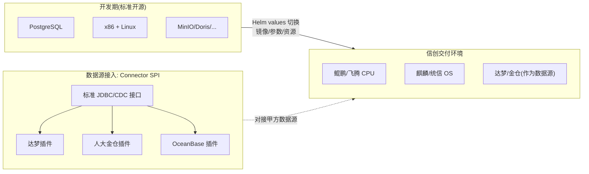

# 04 · 工程与部署

## 1. Git Submodule 仓库结构（按分系统粗粒度）



文本视图：

```
hashmatrix/                     # 主仓：公共依赖 + 部署运维
├── deploy/                     # Helm umbrella chart + 子 chart + 各 env values（prod/test/信创）
├── libs-java/                  # 公共 BOM/starter（统一依赖、日志、审计、多租户）
├── libs-ts/                    # 公共 TS 组件库/前端 SDK
├── contracts/                  # ICD：OpenAPI/protobuf 接口契约（对应交付物）
├── docs/                       # 研制文档（需求/设计/测试/MBSE）
└── services/                   # ↓ 各为独立 git submodule
    ├── webui/          (TS)
    ├── gateway/        (网关配置/插件)
    ├── governance/     (Java)        数据治理分系统
    ├── security/       (Java)        数据安全分系统
    ├── privacy/        (Python+Java) 隐私计算
    ├── data-foundation/(Java/Flink)  采集/计算
    └── platform-common/(Java)        调度/认证/元数据
```

**主仓职责**：维护公共依赖（BOM 统一版本）、ICD 接口契约、部署运维（Helm）、研制文档。**源代码交付**时可按 submodule 边界单独剥离给甲方。

## 2. Helm 部署拓扑

**线框图**：

```text
 ┌─ Kubernetes 集群 ───────────────────────────────────────────────────────────┐
 │  ┌─ ns: gateway ───────┐   ┌─ ns: app  (无状态 · Deployment + HPA) ─────────┐ │
 │  │ APISIX              │   │ governance  security  privacy                   │ │
 │  │ Keycloak            │   │ data-service  platform-common                   │ │
 │  └─────────────────────┘   └─────────────────────────────────────────────────┘ │
 │  ┌─ ns: data (有状态 · 社区 Operator) ─┐   ┌─ ns: observability ─────────────┐ │
 │  │ Kafka  Doris  Milvus  MinIO         │   │ Prometheus/Grafana  Loki         │ │
 │  │ PostgreSQL  Redis  Elasticsearch    │   │ SkyWalking  (OTel Collector)     │ │
 │  └─────────────────────────────────────┘   └──────────────────────────────────┘ │
 └───────────────────────────────────────────────────────────────────────────────┘
            ▲
            └─ Helm umbrella chart ── values: prod / test / 信创 ──▶ 渲染部署
```

**Mermaid 版**：



- **umbrella chart** 聚合各子 chart；不同环境（生产 4 套 / 研发测试 5 套）通过 `values-<env>.yaml` 区分。
- **有状态依赖**（Kafka/Doris/Milvus/MinIO/PG…）优先用各自社区 **Operator** 管理（备份/扩缩/故障转移），主仓无需自研 Operator。
- 无状态应用层用 **Deployment + HPA + Probe** 支撑 99.99% 可用性。

## 3. 信创双轨切换



两条独立可并行推进的工作线：

1. **平台主线**：用标准开源（PG/x86）快速开发迭代各分系统功能。
2. **信创适配线**：① 编写/验证数据源 Connector 插件（达梦/金仓）；② 验证镜像在鲲鹏/麒麟上的构建运行；③ 沉淀 `values-信创.yaml`。两条线互不阻塞，最终在部署层汇合。

> 关键设计：新增一种信创数据库 = 新增一个 Connector 插件 jar，**不改主干代码**；信创/开源切换 = 换 Helm values，**不改应用逻辑**。

## 4. 服务镜像发布契约（版本 / tag / pullPolicy）· AD

> 主仓拍板（D5：主仓 owns charts / 治理发布契约）。源：governance→主仓 Discussion #20。**约束部署型服务镜像**，
> **不含发布型库 `libs-java`**（GitHub Packages，`0.x.y` 不可变 release 语义，自走库的版本节奏）。

**D-发布① · 服务版本：dev 期统一 `-SNAPSHOT`。** 所有部署型服务（governance / security /
data-foundation / control-plane / platform-common …）dev 期 pom 版本统一 `0.1.0-SNAPSHOT`。
- 理由：`-SNAPSHOT` 是 Maven 对「可变 dev 构建」的标准语义；裸 `:0.1.0` 形如不可变 release 却被每次 push main
  覆盖，语义误导。约定上 `:<x.y.z>`（无 SNAPSHOT）应不可变。

**D-发布② · 镜像 tag：CI 推「双 tag」。** 每次 push main 同时推：
- **不可变** `:<version>-<shortsha>`（如 `0.1.0-SNAPSHOT-ab12cd3`）——可复现、可 pin（prod / 排障 / 回滚）；
- **移动** `:0.1.0-SNAPSHOT`——dev 跟随（移动 tag 恰为 SNAPSHOT 版本本身，可变语义自洽）。

**D-发布③ · pullPolicy：chart 默认 `IfNotPresent`，dev values 覆写 `Always`。**
- chart 子模板默认 `imagePullPolicy: IfNotPresent`（对 prod + pin 不可变 tag 正确，不动）；
- **dev / M1** 部署 values 用移动 tag `:0.1.0-SNAPSHOT` + 覆写 `pullPolicy: Always` → 零 per-build 改 values、
  规避「节点缓存旧 tag 不再拉取 → 部署陈旧」的隐蔽坑；
- 成熟期 / prod：切回 pin `:<version>-<shortsha>` + `IfNotPresent`（可复现优先）。

**落地分工**：各服务仓改 pom 版本 + CI 推双 tag（子仓 owns image，D5）；主仓把对应服务 deploy values 切到
移动 tag + `Always`（主仓 owns charts/values）。**端口**一律对齐 [M1 总纲 §3 端口基线](../milestones/M1-单命名空间端到端贯通.md)
（如 governance 应用 8082 / 管理 9082）——deploy values 的服务 `port` 即应用端口，勿滞后于子仓实际端口。
