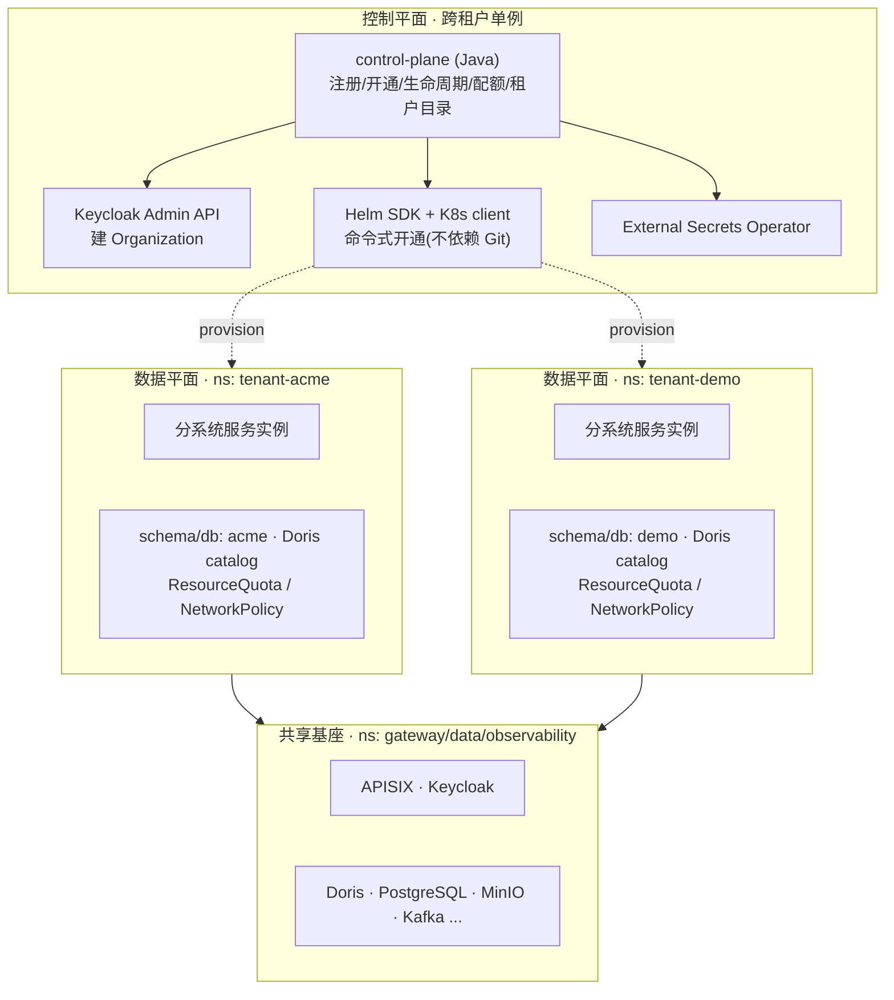
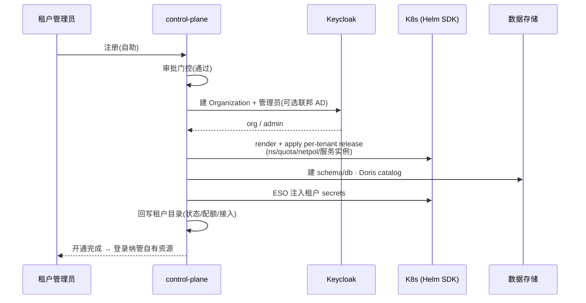
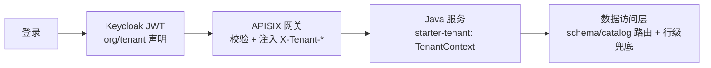

# 05 · 多租户与控制平面

> 本篇定义平台的多租户模型与控制平面设计。决策来源见主仓 `docs/00-主仓初始化-spec.md`。
> 占位均为虚构（如 `tenant-demo` / `acme`），不含任何真实甲方信息。

## 1. 双模产品形态

平台**双模交付**，"租户"语义随模式而变，但**隔离机制同一套**；**品牌为部署级**（非按租户运行期换肤，与 webui `config.js` 覆盖机制一致）。

```text
┌─ 公网 SaaS（我们运营） ───────────────┐   ┌─ 私有化部署（客户环境） ──────────────┐
│ 品牌 = 我们公司（统一界面风格）        │   │ 品牌 = 客户（部署级，部门统一）        │
│ 租户 = 企业客户                        │   │ 租户 = 客户的部门                      │
│ acme 公司 / beta 公司 / ...            │   │ 部门A / 部门B / ...（同一客户品牌下）  │
└────────────────────────────────────────┘   └────────────────────────────────────────┘
        └──────────── 隔离机制相同：身份/数据/计算/网络逐层隔离 ────────────┘
```

| 模式 | 运营方 | 品牌 | 租户= | 隔离单元 |
|------|--------|------|-------|---------|
| 公网 SaaS | 我们 | 我们公司统一品牌 | 一个企业客户 | 企业 |
| 私有化部署 | 客户自有环境 | 客户品牌（部署级） | 客户的部门 | 部门 |

## 2. 控制平面 / 数据平面 总览

**线框图**：

```text
┌─ Kubernetes 集群 ───────────────────────────────────────────────────────────┐
│  ┌─ 控制平面(跨租户单例) ───────────────────────────────────────────────────┐ │
│  │ control-plane(Java)  租户注册/开通编排/生命周期/配额/租户目录             │ │
│  │   │  ① Keycloak Admin API(建 Organization)                              │ │
│  │   │  ② Helm SDK + Kubernetes client(命令式开通, 不依赖 Git)             │ │
│  │   │  ③ External Secrets Operator(注入租户 secrets)                      │ │
│  └───┼──────────────────────────────────────────────────────────────────────┘ │
│      ▼ 按需 provision                                                          │
│  ┌─ 数据平面 ns: tenant-acme ─────────┐   ┌─ 数据平面 ns: tenant-demo ───────┐ │
│  │ governance security ...            │   │ governance security ...          │ │
│  │ schema/db: acme · Doris catalog    │   │ schema/db: demo · Doris catalog  │ │
│  │ ResourceQuota / NetworkPolicy      │   │ ResourceQuota / NetworkPolicy    │ │
│  └─────────────────────────────────────┘   └──────────────────────────────────┘ │
│  ┌─ 共享基座 ns: gateway/data/observability(APISIX·Keycloak·Doris·PG·...) ───┐ │
│  └────────────────────────────────────────────────────────────────────────────┘ │
└───────────────────────────────────────────────────────────────────────────────┘
```

**Mermaid 版**：



> 关键：**控制平面是一等 K8s 编排者**，经 Helm SDK + Kubernetes client 命令式开通租户，生产期**不耦合 Git/Argo**；Argo CD 仅作共享基座的可选 GitOps。

## 3. 隔离维度定档

| 维度 | 选档（弱→强） | **本平台定档** |
|------|--------------|---------------|
| 供给模型 | 池化 → 分层 → 孤岛 | **C 分层/Bridge**：控制平面共享 + 数据平面按租户隔离 |
| 身份 | 单 realm 行级 → **Organizations** → realm-per-tenant | **Keycloak Organizations 单 realm**（org=租户，JWT 带 tenant 声明，可按 org 联邦自有 AD；强隔离租户可升独立 realm 作 escape hatch） |
| 数据 | 行级 tenant_id → **schema/db** → 独立栈 | **schema/db-per-tenant**：PG schema/db + Doris/Paimon catalog/database |
| 计算 | 共享逻辑 → **namespace** → vCluster | **namespace-per-tenant** + ResourceQuota/LimitRange（监管/大客户可升 vCluster） |
| 计算调度后端 | K8s namespace（强）→ YARN queue（弱） | **默认 On K8s**（`namespace-per-tenant`，强）；存量 Hadoop 客户私有化可部署期切 **On YARN**（`queue-per-tenant`，弱）——见下方说明与 `docs/architecture/README.md` **AD-18** |
| 网络 | 共享 → **NetworkPolicy** → 独立入口 | 命名空间 **NetworkPolicy**（Kyverno/Cilium） |
| 规模 | — | 个位数~十几个政企大客户（≤15），预留向数十演进 |

> **计算调度后端（双模适配 · On K8s 默认 / On YARN 后置 profile）**：平台计算引擎（Spark 批 / Flink 流，含其上的 SeaTunnel）对资源调度器做统一抽象，**部署期**二选一，**同一份作业逻辑两模通用**、差异收敛在部署配置、不改业务代码。
> - **默认 On K8s**：计算 = `namespace-per-tenant`（强隔离），与平台服务共用同一套 K8s 运维面。
> - **可选 On YARN**：面向**已具备成熟 Hadoop/YARN 的客户私有化场景**，复用客户既有算力与运维体系。此时**仅 Spark/Flink 临时计算作业**落 YARN，平台其余栈（Doris / Paimon@MinIO / Kafka / PG / 各服务 / 网关 / 控制平面 / webui）**不变**；YARN **仅作资源管理器**借用，**引擎由我方交付、存储统一走对象存储**（不绑 HDFS 数据本地性）以防两套部署分叉。提交/编排复用 DolphinScheduler（批）/ StreamPark·Kyuubi 等开源能力，不手搓 YARN RPC。
> - ⚠️ **隔离强度不等价，必须明示**：On YARN 计算隔离降级为 `queue-per-tenant`（弱），且 v1 对 Hadoop 为**单一平台服务身份**、租户隔离纯靠队列 ACL/容量——方案中**不得将两模默认等价**（对"租户=部门"私有化场景通常可接受，但须注明差异）。
> - **节奏**：M1 仅**预留调度后端抽象层、默认实装 On K8s**；On YARN 为**已登记的后置交付 profile**，在面向存量 Hadoop 客户的私有化项目中按需实装，不影响主线。详见 **AD-18**。

## 4. 租户开通时序

**线框图**：

```text
租户管理员        control-plane         Keycloak        K8s(Helm SDK)      数据存储
   │  注册(自助)      │                     │                 │                │
   ├────────────────▶│                     │                 │                │
   │                 │  审批门控(通过)      │                 │                │
   │                 ├──建 Organization────▶│                 │                │
   │                 │◀──org/admin─────────┤                 │                │
   │                 ├──render+apply per-tenant release──────▶│                │
   │                 │     (ns/quota/netpol/服务实例)         │                │
   │                 ├──建 schema/db · Doris catalog──────────┼───────────────▶│
   │                 ├──ESO 注入 secrets                      │                │
   │                 │  回写租户目录(状态/配额/接入信息)      │                │
   │◀── 开通完成，登录纳管自有资源 ──────────────────────────┤                │
```

**Mermaid 版**：



## 5. 租户上下文透传

```text
登录 → Keycloak 颁发 JWT(含 org/tenant 声明)
     → APISIX 网关校验 + 注入 X-Tenant-* 头
     → 各 Java 服务 starter-tenant 统一取用 TenantContext
     → 数据访问层按 tenant 路由 schema/catalog + 行级兜底过滤
```



> `starter-tenant` 由 `libs-java/` 统一提供（见架构 04 与主仓 `libs-java`），各 Java 服务依赖即获多租户上下文能力，避免各仓重复实现。

## 6. 身份模型说明（Keycloak Organizations）

- **单 realm**：避免 realm-per-tenant 在多租户下的管理与性能负担；login 品牌部署级统一，无需 per-tenant 主题。
- **org = 租户**：公网=企业、私有化=部门；用户隶属 org，JWT 带 org/tenant 声明。
- **联邦自有 AD**：企业可按 org 配置身份联邦（对接客户 AD/LDAP）。
- **escape hatch**：个别要求身份硬隔离/独立 IdP 的租户，可单独升为独立 realm，架构同时容纳两种。
